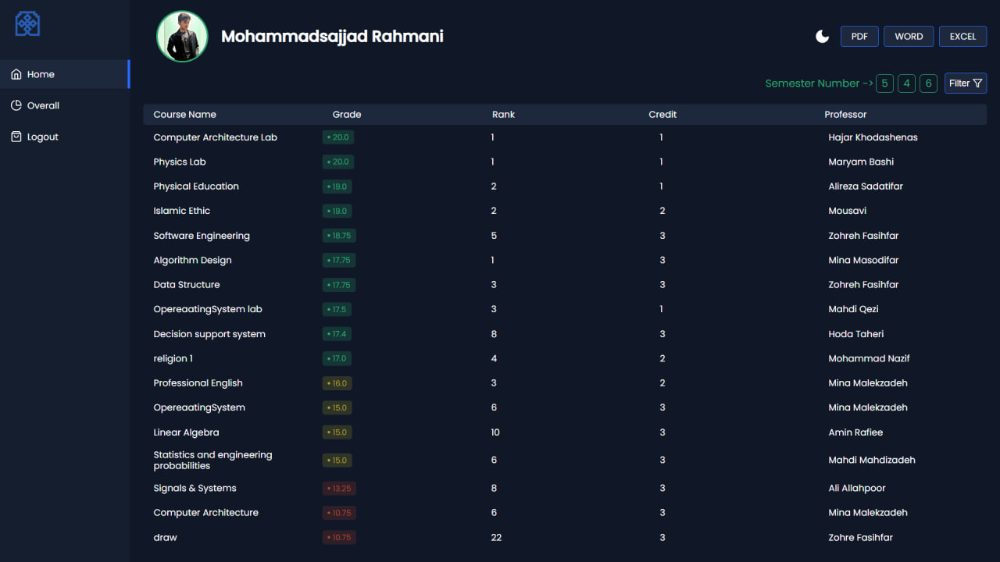
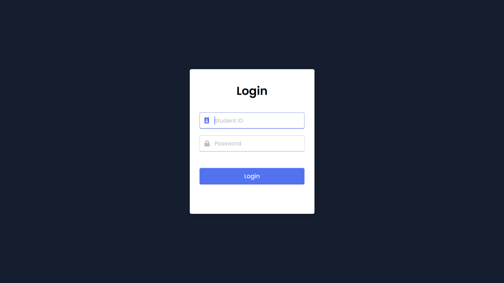
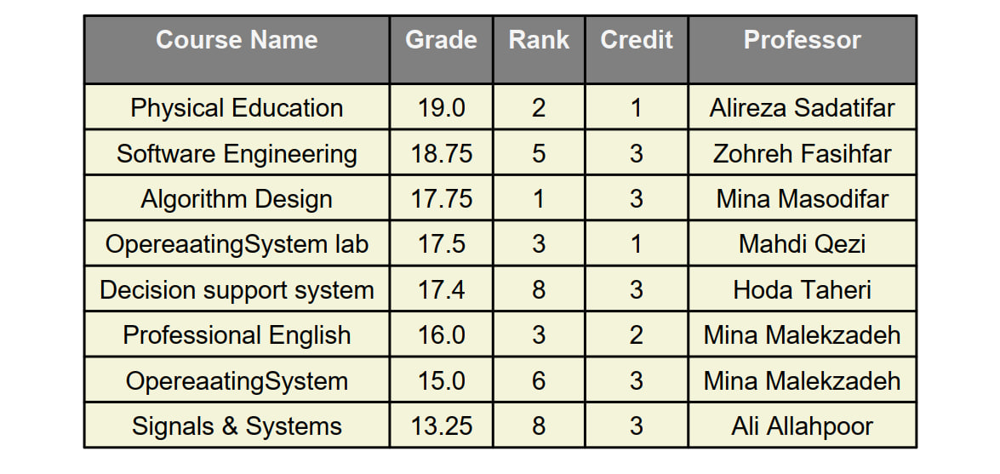

# Django Ecommerce Store  
A fully functional e-commerce website built with Django using MVT.  

## Features  
✅ User authentication (Signup/Login)  
✅ Product listing with categories  
✅ Shopping cart & checkout system  
✅ Order history & user profile  
✅ Admin panel for product management  

## Screenshots  
### 🛍️ Dashboard Page  
  

### 🔒 Login Page  
  

### 🗃️ PDF Export Test  
 

### 🔹 Installation  
1. Clone the repository:
2. 2. Install dependencies:  
3. Run migrations:  
4. Start the server:  

## 📌 Tech Stack  
- Django    
- openpyxl (for Excel export)  
- reportlab (for PDF export)
- docx (for Word export)  
